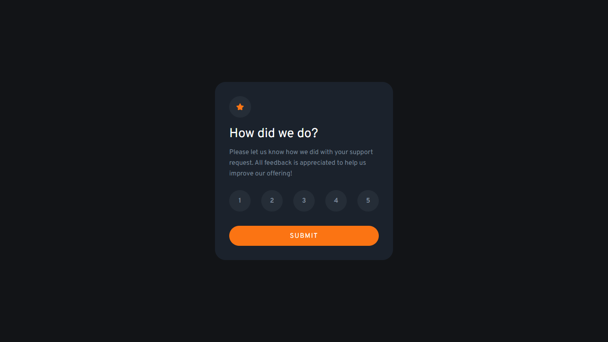

# Frontend Mentor - Interactive rating component solution

This is a solution to the [Interactive rating component challenge on Frontend Mentor](https://www.frontendmentor.io/challenges/interactive-rating-component-koxpeBUmI). Frontend Mentor challenges help you improve your coding skills by building realistic projects. 

## Table of contents

- [Overview](#overview)
  - [The challenge](#the-challenge)
  - [Screenshot](#screenshot)
  - [Links](#links)
- [My process](#my-process)
  - [Built with](#built-with)
- [Author](#author)

## Overview

### The challenge

Users should be able to:

- View the optimal layout depending on their device's screen size
- See hover and focus states for interactive elements

### Screenshot

### Links

- Solution URL: [Interactive rating-Solution](https://github.com/Mohan823/interactive-rating.git)
- Live Site URL: [Interactive rating-Live](https://mohan823.github.io/interactive-rating/)

## My process

- Using Sass Css to simplify analyses in future.
- Targetting which one is most important (mobile/desktop)
- Then, I made css from sass then convert it for another devices via media queries.

### Built with

- Semantic HTML5 markup
- Flexbox
- Css
- Sass Css

## Author

- Frontend Mentor - [Mohan Krishna](https://www.frontendmentor.io/profile/Mohan823)
